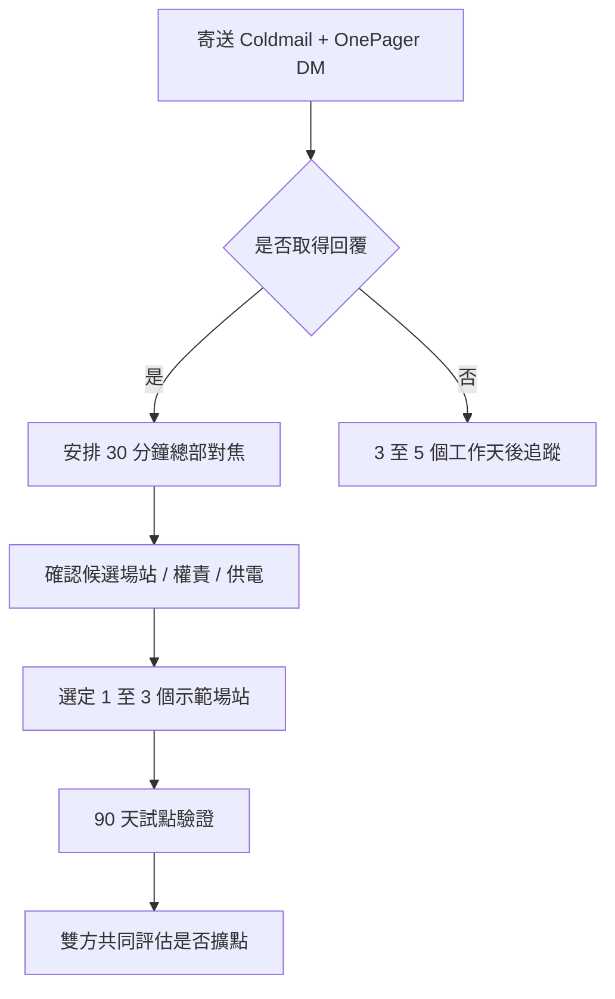

# PARK24 / Times BD 開發圖紙

## 開發路徑

```text
OnePager DM
↓
Coldmail 寄送
↓
取得總部或合作窗口
↓
30 分鐘總部對焦
↓
確認 1 至 3 個示範場站
↓
90 天試點驗證
↓
雙方共同評估是否擴點
```

## 本次寄信目的

```text
不是要求 PARK24 / Times 立即合作
不是要求 PARK24 / Times 提供大量點位
而是取得一個能說明總部試點框架的會議機會
```

## 對方可能反應與回應方向

### 對方有興趣

```text
感謝回覆，建議安排 30 分鐘會議，先就候選場站、供電、權責與試點 KPI 做初步對焦。
```

### 對方詢問是否需要租停車格

```text
本案不是承租停車格，會優先評估不影響車格、車道與停車收益的邊角空間。
```

### 對方擔心現場管理負擔

```text
旺來負責設備、客服、補貨、維修、法遵、保險與數據回顧，Times 主要協助候選場站與現勘窗口。
```

### 對方詢問是否要大量點位

```text
初期不討論大量點位，建議先以 1 至 3 個示範場站驗證，再依資料共同評估是否擴大。
```

## Mermaid 流程圖



